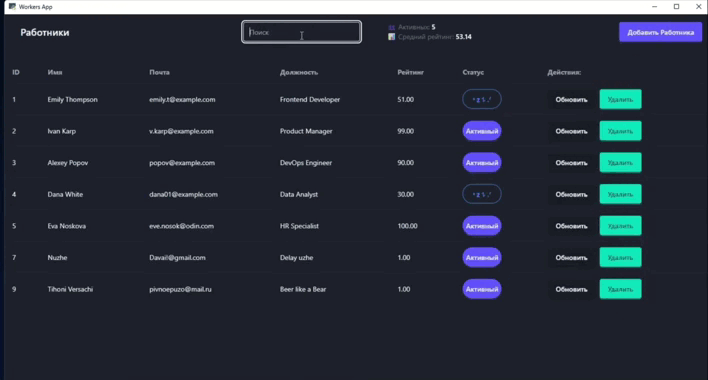

# 💼 Workers Manager
# Десктопное клиент-серверное приложение.

**Разработал:** Василий Егоршин  

Полноценное приложение для управления сотрудниками с возможностью добавления, редактирования, удаления и поиска. Подходит для HR-отделов, администраторов и небольших компаний.



---

## 🚀 Возможности

- 📋 Просмотр и фильтрация списка сотрудников
- ✏️ Добавление и редактирование данных
- ❌ Удаление сотрудников
- 🔍 Поиск по имени, email или должности
- 📈 Подсчёт активных сотрудников и среднего рейтинга
- 🎯 Удобный и минималистичный UI в едином стиле (web и desktop)


## 🛠️ Стек 

|                  |                          |
|------------------|--------------------------|
| Backend          | Python(Flask) + Postgre  |
| Frontend         | React + Tailwind CSS     |
| Desktop          | PyWebView         |
| База данных      | PostgreSQL               |


## ⚙️ Установка и запуск

### 🔹 Backend

```bash
cd backend
pip install -r requirements.txt
python app.py
```

### 🔹 Frontend

```bash
cd frontend
npm install
npm run dev
```

### 🔹 Десктопная версия

```bash
python dekstop.py
```


